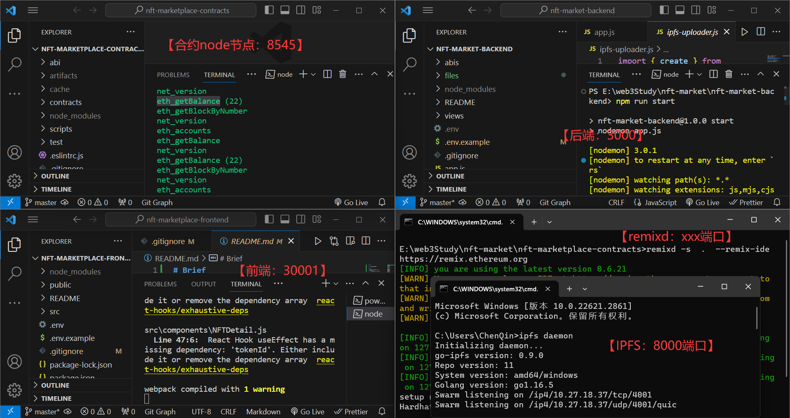

# Brief

一个简单的NFT交易市场

# Usage

1. 克隆然后安装依赖：`npm i`
2. 准备工作
   1. 启动IPFS：`ipfs daemon`
   2. 启动合约项目：
      1. 启动节点：`npx hardhat node`（我们的用户是第一个，metamask记得替换）
      2. remixd启动：`remixd -s  .  --remix-ide https://remix.ethereum.org`
      3. remix部署nft, usdt, market合约，得到三个地址，将三个地址替换为前端.env文件中
      4. 启动前端代码：`npm run start`
3. 启动后端代码：`npm run start`

总共如下启动项目

页面

